:::message
この記事は、[CYBOZU SUMMER BLOG FES '24](https://cybozu.github.io/summer-blog-fes-2024/) (Frontend Stage) DAY 8の記事です。
:::

こんにちは！サイボウズ株式会社フロントエンドエンジニアの [protein_mochi](https://x.com/protein_mochi) です！
夏といえば、サマータイム！

今回は、「夏」と言えば手放せない存在の1つ「**サマータイム(DST)**」を紹介しつつ、Web上でサマータイムを考慮して時差の計算をする際のややこしい部分をピックアップして、それぞれの問題点と考えられる対応策をお届けします。

## サマータイム？あ、あの美味しいやつね

サマータイムとは、アメリカではDaylight Savings Time(DST)と呼ばれるもので、春から秋の日が長い時期に通常1時間時計を進める取り組みです[^1]。

これにより、日照時間を有効活用できるなどの効果があります。

:::details bonus：サマータイムは実際有益なのか？
サマータイムの必要性に関しては色々な説がありますが、議論の余地はあるものの、よく見かけるのが以下の2つです。
1. 太陽からの光を最大限に活用することで、エネルギーコストを削減する[^2]
   - 例：お仕事を始める時間が早まる分、残業をしても暗くなる時間が遅いので電気代を抑えられる
2. 人々の活動時間が伸びることで得られる経済効果[^3]
   - 例：外で何かしら経済活動をする時間が増える
:::

## サマータイムの何がややこしいんや

サマータイムにより、**サマータイム適用地域（例：フランス/パリ）と非適用地域（例：日本/東京）との間で時差の計算がややこしくなります**。

「地域間の時差に加えて、サマータイムの時期には+1時間差分加えて時差を計算すれば良いのでは？」と思うかもしれませんが、以下の3ケースを考慮する必要があります。
1. サマータイムの発生/終了する瞬間
2. timezone情報baseが複数存在する
3. 未来にある(orない)はずだったサマータイムが今はない(orある)

## ややこしい point 1: サマータイムの発生/終了する瞬間

サマータイムは基本的に春頃に標準時から時間を1時間進めて、秋に1時間戻す操作を行います。

そのため春頃にあるサマータイム開始日では夜中のどこかで1時間時刻が無くなります。

```mermaid
gantt
    title 時刻前倒しのイメージ(時刻を1時間飛ばす)
    dateFormat HH:mm
    axisFormat %H:%M
    サマータイム開始前の時間線 :a, 01:00, 1h
    飛ばされた時間 :crit, b, after a, 1h
    サマータイム開始後の時間線 :active, c, after b, 1h
```

逆に秋頃にあるサマータイム終了日では、夜中のどこかの時刻が２回来ることになります。

```mermaid
gantt
    title 時刻後ろ倒しのイメージ(同時刻が2回発生)
    dateFormat HH:mm
    axisFormat %H:%M
    サマータイム終了前の時間線 :a, 01:00, 2h
    2度発生する時間 :crit, b, 02:00, 1h
    サマータイム終了後の時間線 :active, c, 02:00, 2h
```

問題は、ユーザーが飛ばした時刻や重複した時刻を指定してしまった際に、時差をどう計算するかが曖昧になってしまうことです。具体的には、飛ばした時刻や重複した時刻をサマータイムの範囲内とするのか否かは変換処理次第になります。

例えば、開始日の02:00にサマータイムが始まる場合は、その日の02:00~03:00が無くなります。このような状況で、無いはずの02:30を指定した際にどうなるかを考えると、以下のように２つのパターンが考えられます。

どちらで解決するかが定まってないと、他地域やUTCへの時刻変換をする際、一貫性を保てなくなります。

### 対応策

現在のJSの[Date object](https://developer.mozilla.org/en-US/docs/Web/JavaScript/Reference/Global_Objects/Date)や、iCalendar([RFC5545](https://datatracker.ietf.org/doc/html/rfc5545))の挙動に準拠するのが望ましいと考えられます。

これは具体的に以下のような挙動になります。

また、この挙動は多くの日時ライブラリーで採用されている挙動でもあります。

*npm downloadsが多い４つの日時関連libraries[^4]*

これらの日時処理のライブラリーを使うのも良いですし、自前で実装をする場合は、上記の挙動に従ってサマータイムの開始・終了時の計算ロジックを組むと良さそうです。

:::details bonus：少し未来の話
現在[Temporal](https://tc39.es/proposal-temporal/docs/index.html)という、日時を操作するための新たなJSの標準objectが提案されています。Temporalが無事標準化すれば、libraryに依存せず、複数のタイムゾーンの計算を行うことができます！上記のサマータイムの開始・終了時の挙動をカスタマイズのオプションも合わせて提案されています。

詳しくは、こちらを参考するとよさそうです！
https://tc39.es/proposal-temporal/docs/ambiguity
:::

## ややこしい point 2: timezone情報baseが複数存在する

基本的にサマータイムの情報は何らかのtimezone情報baseに保管されますが、これらのdatabaseは環境によって異なる場合があります(IANA、Windows time zone、企業独自DB、など)。

これにより、同サービスで異なるtimezoneDBを使ってしまうと、ユーザー側で一貫した日時計算結果を保証できない可能性があります。

例えば、JSのDate objectを使う際に、暗黙的にJSDateのtimezone情報による変換を利用してしまうと、異なるtimezoneDBを使ってしまうことに繋がる可能性があります。

### 対応策

独自でtimezone情報を管理する場合は、ライブラリーや標準objectの挙動によって、暗黙的に異なるtimezoneDBを使った変換が行われないように注意する必要があります。また、timezone情報は各国の方針によって変わることが多いので、追従するメンテナンスコストも考える必要があります。

現時点では[IANA](https://www.iana.org/)(Internet Assigned Numbers Authority)のtimezoneDBがWebに関連する標準機能や環境で広く使われることから、IANAのtimezoneDBに準拠したlibraryなどを使うのも考えられます。 
- dayjs
- momentjs
- luxon
- など

## ややこしい point 3: 未来にある(orない)はずだったサマータイムが今はない(orある)

以下のようなシナリオを想像してみましょう。
1. 先週、来年のお誕生日会の**サマータイムが適用された予定日時**を記録した
2. しかし、今週になってみると**来年からサマータイムを廃止するとのことに**なった

このように、サマータイムの情報も含んでいるtimezone情報に差分が生じると、既存のサマータイムを反映した日時計算と、新しくサマータイムを反映しない日時計算の結果でコンフリクトが生じてしまいます。今回の例えの場合だと、新timezone情報を基準に、先週までは正確だった未来の日時計算結果が、今では1時間ズレていることになります。

### 対応策

以下のように実装ができていると、問題なく対応ができると思います。

- 日時は必ずunix time stampかUTCでかつ、国際標準日時表記フォーマット([ISO8601string](https://en.wikipedia.org/wiki/ISO_8601))に準拠した状態で保存すること
- ユーザーに日時を表示するタイミングや、入力を受け取ったタイミングで、ローカルな日時への変換やローカルな日時からの変換を行うこと

:::details bonus：過去にある(orない)はずだったサマータイムが実はない(orある)場合
timezone情報へ加わる差分は常に前向きなので、例えば、すでに過去になった日時表記に、新たに追加・廃止されたサマータイム情報を反映する必要はありません。
しかし、以下のような(ほぼありえないですが)場合は、対応が必要になってしまいます！[^5]
- 日付や時刻関連で新たな歴史的証拠などを発見

対応策としては、幸い上記の対応策と準拠した実装ができていると問題ないかと思います。
:::

## 終わり

夏になると思い出すサマータイムの話でした。

サマータイムは変動性があることから、対応をするにあたって考慮すべきポイントがいくつかある取り組みです。

今回ご紹介した、サマータイムを考慮して日時を計算する際の問題点と対応策が、Webサービスの国際化にあたって部分的にでも参考になれればと思います！

[^1]: https://dictionary.cambridge.org/dictionary/english/daylight-saving-time
[^2]: https://www.nytimes.com/article/daylight-saving-time-questions.html
[^3]: https://finance.yahoo.com/news/little-known-financial-benefits-daylight-171953855.html
[^4]: https://npmtrends.com/date-fns-vs-dayjs-vs-luxon-vs-moment
[^5]: https://tc39.es/proposal-temporal/docs/ambiguity.html#understanding-time-zones-offset-changes-and-サマータイム
