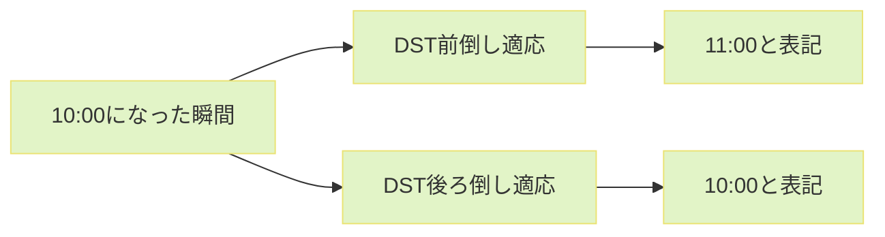
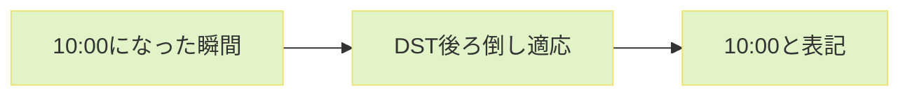
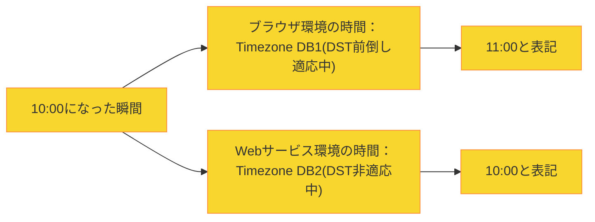
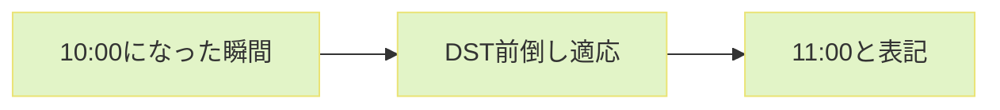

:::message
この記事は、[CYBOZU SUMMER BLOG FES '24](https://cybozu.github.io/summer-blog-fes-2024/) (Frontend Stage) DAY 8の記事です。
:::

こんにちは！サイボウズ株式会社フロントエンドエンジニアの [protein_mochi](https://x.com/protein_mochi) です！
「夏」を英訳すると「サマータイム」！
「サマータイム」と言えば「DST」！

今回は、「夏」と言えば手放せない存在の1つ「**DST**」を紹介しつつ、Webサービス上でDSTを考慮して日時を表記する際のややこしい部分をピックアップして、それぞれの問題点と考えられる対応策をお届けします。

## DST？あ、あの美味しいやつね

DSTとは、Daylight Savings Timeの略語であって、日本ではよく「サマータイム」と呼ばれています。日が長い時期になると、特定の地域では通常時間に1時間を調整することで[^1]、定められた時期が終わるまでは普段より1時間のずれを発生させる奇妙なシステムです。

## DSTの必要性

DSTの必要性に関しては色々な説がありますが、議論の余地はあるものの、よく見かけるのが以下の2つです。
1. 太陽からの光を最大限に活用することで、エネルギーコストを削減する[^2]
   - 例：お仕事を始める時間が早まる分、残業をしても暗くなる時間が遅いので電気代を抑えられる
2. 人々の活動時間が伸びることで得られる経済効果[^3]
   - 例：外で何かしら経済活動をする時間が増える

## DSTの何がややこしいんや

DSTにより、**DST適応地域（例：フランス/パリ）と非適応地域（例：日本/東京）越しで日時表記がややこしくなります**。

「地域間の時差に加えて、DSTの時期には+1時間差分加えて日時を表示すればいい話では？」と思うかもしれませんが、以下の3ケースを考慮する必要があります。
1. DSTの発生/終了する瞬間
2. Timezone Databaseが複数存在する
3. 未来にある(orない)はずだったDSTが今はない(orある)

## ややこしい point 1: DSTの発生/終了する瞬間

現状DSTによる1時間の調整を前倒しにするか後ろ倒しにするかがJSの標準としてはまだ明確とされていないです。例えば、10:00がDSTが始まる瞬間の場合は、以下のように２つのパターンがあり得ますので、何かしらのコンセンサスが必要な状況です。

上記に関するコンセンサスがないことから、仮に日時表記をパリ(DST地域)から東京(非DST地域)へ変換する際に、パリ現地の日時情報だけでは正確な日時変換ができなくなってしまいます。

### 対応策

現状としては、100%ではないものの、一旦はできるだけ多くのコンセンサスを得ている基準に従うことが簡単明瞭かと思います。

*npm downloadsが多い４つの日時関連libraries[^4]*

チャート上のlibrariesは全て以下の基準を設けていますので[^5][^6]、どれか1つのlibraryを使うことを考慮するのも良いですし、実装をする場合は、以下の基準に沿ってDSTの処理ロジックを組むと良さそうです。

- DST開始の時刻は前倒し(+1時間)

- DST終了の時刻は後ろ倒し(-1時間)

加えて、上記の基準はcross-platform挙動の標準([RFC5545](https://datatracker.ietf.org/doc/html/rfc5545))にも基づくものなので[^5]、さらに一安心ですね。

:::details bonus：少し未来の話
現在[Temporal](https://tc39.es/proposal-temporal/docs/index.html)という、日時を操作するための新たなJSの標準objectを定義しようとする動きがあります。Temporal objectが無事JSの標準と認められたら、libraryに依存せず、こちらを使うことも考慮できるかと思います！
Temporalに関しては[saji](https://zenn.dev/sajikix)さんからのまとめ記事があるので、参考するとよさそうです！
https://zenn.dev/cybozu_frontend/articles/temporal-reduces-scope
:::

## ややこしい point 2: Timezone Databaseが複数存在する

DSTの情報は何らかのtimezone databaseに保管されますが(IANA、Windows time zone、企業独自DB、など)、問題は複数のtimezone databaseが存在することです。

これにより、以下のようにユーザー側で一貫した日時表記を保証できない可能性が生じてしまいます。

### 対応策

まず、独自のtimezone DBの管理を考えている場合は、データ完全性を考えてでもより慎重に考慮すべきかと思います。それから、メンテナンスコスト対比リターンが低くなる可能性があることも１つのリスクとして掲げられます。

今だに標準化したtimezone DBはないですが、現時点では[IANA](https://www.iana.org/)(Internet Assigned Numbers Authority)のtimezone DB 管理手順が[RFCからベストプラクティス](https://www.nic.ad.jp/ja/rfc-jp/RFC-Category.html)と認められています[^7]。よって、拡張apiなどを通してIANA管理下のtimezone DBを活用できる以下のlibraryの使用を考慮するのも、一貫した日時表記を保証する1つの方法かと思います。
- dayjs
- momentjs
- luxon
- など

:::details bonus：少し未来の話 2
上記の「bonus：少し未来の話」で紹介した[Temporal](https://tc39.es/proposal-temporal/docs/index.html) objectは、デフォルトでIANA timezone DBを使う予定です[^5]。なので、大きな差分が生じないままTemporalが無事JSの標準と認められたら、libraryに依存せずとも直接Temporal objectを使うことも考慮できるかと思います！
:::

## ややこしい point 3: 未来にある(orない)はずだったDSTが今はない(orある)

以下のようなシナリオを想像してみましょう。
1. 先週、来年のお誕生日会の**DSTが適応された予定日時**を記録した
2. しかし、今週になってみると**来年からDSTを廃止するとのことに**なった

このように、DSTの情報も含んでいるtimezone dataに差分が生じると、既存のDSTを反映した日時表記と、新しくDSTを反映しない日時表記でコンフリクトが生じてしまいます。今回の例えの場合だと、新timezone dataを基準に、先週までは正確だった未来の日時表記が、今では1時間ズレていることになります。

- 過去timezone data基準の場合

- 新しいtimezone data基準の場合

### 対応策

以下のように役割分担ができていると、問題なく対応ができると思います。
- DB: DSTを無視した状態での、国際標準日時表記フォーマット([ISO8601string](https://en.wikipedia.org/wiki/ISO_8601))で日時情報を保管
- FE: ユーザーに日時を表示するタイミングで、比較的に最新化が早いことが期待できる[IANA](https://www.iana.org/)などのtimezone DBからの最新DST情報を使ってISO8601stringを適当な地域のタイムゾーンに合わせて日時を変換および表示する

:::details bonus：過去にある(orない)はずだったDSTが実はない(orある)場合
timezone dataへ加わる差分は常に前向きなので、すでに過去になった日時表記に、新たに追加・廃止されたDST情報を反映する必要はありません。
しかし、以下のような(ほぼありえないですが)場合は、対応が必要になってしまいます！[^8]
- 日付や時刻関連で新たな歴史的証拠などを発見

対応策としては、幸い上記の対応策と同じように役割分担がしっかりできていると問題ないかと思います。
:::

## 終わり

夏になると思い出すDSTの話でした。

DSTは変動性がありながらも、色々と標準化ができていない結果、対応をするにあたって考慮すべきポイントがいくつかあるシステムです。

今回ご紹介した、DSTを考慮して日時を表記する際の問題点と対応策が、Webサービスの国際化にあたっての部分的参考になればと思います！

[^1]: https://dictionary.cambridge.org/dictionary/english/daylight-saving-time
[^2]: https://www.nytimes.com/article/daylight-saving-time-questions.html
[^3]: https://finance.yahoo.com/news/little-known-financial-benefits-daylight-171953855.html
[^4]: https://npmtrends.com/date-fns-vs-dayjs-vs-luxon-vs-moment
[^5]: https://tc39.es/proposal-temporal/docs/ambiguity.html#resolving-time-ambiguity-in-temporal
[^6]: https://github.com/iamkun/dayjs/blob/0898d9f63a82e233d63401d2dcf688bdb2b54e57/test/plugin/timezone.test.js
[^7]: https://www.rfc-editor.org/rfc/rfc6557.html
[^8]: https://tc39.es/proposal-temporal/docs/ambiguity.html#understanding-time-zones-offset-changes-and-dst
